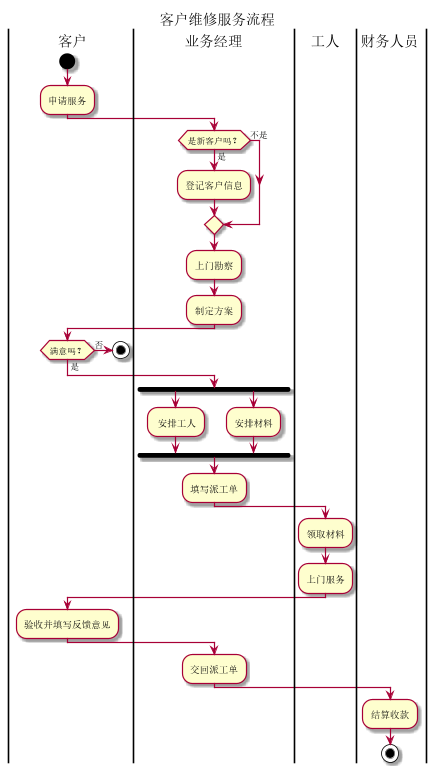

# 实验1：业务流程建模
## 流程图1：考试及成绩管理流程
``` flow1
@startuml
title 考试及成绩管理流程
|教务处|
start
:考试安排;
:考试安排表;
|教师|
:出卷;
if(A,B试卷)
|教师|
else
:打印审批表;
|系主任|
:审批签字;
:打印审批表;
endif
|教师|
:打印试卷;
:试卷;
|学生|
:参加考试;
:答题;
|教师|
:阅卷出成绩;
if(成绩单)
|教务处|
:有不及格的?;
->有;
if(安排补考)
:补考安排表;
detach
endif
else
|教师|
:答卷;
:装订存档;
endif
:期末流程结束;
stop
@enduml
```
**业务流程图如下：**


**流程说明：**

期末考试前，教务处负责安排全校课程的考试时间和地点，下发“考试安排表”。然后，各任课老师准备好A,B两份试卷填写
“试卷打印审核biao”一并交与系主任审批签字，将选中的期末试卷和已签字的“试卷打印审批表”送交教务处印刷部门进行印刷。
在考试时，学生按时到达指定的考场参加考试，考试完毕任课老师进行阅卷，产出成绩单，并对学生答卷装订存档。如果课程有不
及格情况，教务处负责补考时间和地点，产生“补考安排表”，流程结束。

## 流程图2：客户维修服务流程
``` flow2
@startuml
title 客户维修服务流程
|客户|
start
:申请服务;
|业务经理|
if(是新客户吗？) then (是)
:登记客户信息;
else (不是)
endif
:上门勘察;
:制定方案;
|客户|
if(满意吗？) then (否)
stop
else (是)
endif
|业务经理|
 fork
	: 安排工人;
  fork again
	:安排材料;
  end fork
:填写派工单;
|工人|
:领取材料;
:上门服务;
|客户|
:验收并填写反馈意见;
|业务经理|
:交回派工单;
|财务人员|
:结算收款;
stop
@enduml
```
**业务流程图如下：**
...



**流程说明：**

客户申请服务，如果客户是新客户，业务经理将该客户的基本信息记录下来。接下来业务经理将上门进行勘察，并制定具体
“维修方案”。业务经理和客户进行沟通，如果达成一直，则签订正式“服务合同”，否则流程终结。根据合同方案，
业务经理将对试试维修的人员和所所需材料进行计划，并填发“派工单”。工人拿到派工单后，领取制定材料上门施实服务。
服务完成后客户进行验收，并在“派工单”上填写维修信息和反馈意见。业务经理收回派工单后，通知财务人员进行项目
的结算并收款，流程结束。