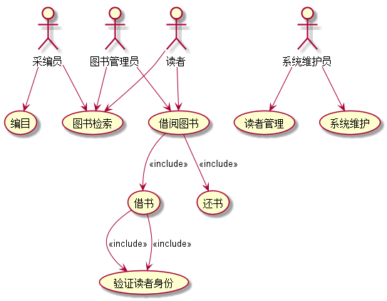

# 实验2：图书管理系统用例建模（老师示范）
|学号|班级|姓名|
|:-------:|:-------------: | :----------:|
|201710414401|软件(本)17-4|陈泯全|
## 1. 图书管理系统的用例关系图

### 1.1 用例图PlantUML源码如下：

``` usecase
@startuml
usecase (编目)
usecase (图书检索)
usecase (借阅图书)
usecase (读者管理)
usecase (系统维护)
usecase (借书)
usecase (还书)
usecase (验证读者身份)
actor :采编员:
actor :读者:
actor :系统维护员:
actor :图书管理员:
:采编员: --> (编目)
:采编员: --> (图书检索)

:读者: --> (图书检索)
:读者: --> (借阅图书)

:图书管理员: --> (图书检索)
:图书管理员: --> (借阅图书)

:系统维护员: --> (读者管理)
:系统维护员: --> (系统维护)

(借阅图书) --> (借书) : <<include>>
(借阅图书) --> (还书) : <<include>>

(借书) --> (验证读者身份) : <<include>>
(借书) --> (验证读者身份) : <<include>>
@enduml
```


### 1.2. 用例图如下：



## 2. 参与者说明：

###     2.1 采编员

主要职责是：为图书馆购买新的图书并对图书进行编码

###     2.2 图书管理员

主要职责是：管理图书馆所有的书籍借出与归还

###     2.3 读者
    
主要职责是：在图书管中借阅图书与归还图书

###     2.4 系统维护员
    
主要职责是：在图书馆中管理读者与维护图书管理系统

##     3. 用例规约表

###     3.1 “借出图书”用例

参见：表7.5

###     3.2 “购入图书”用例

参见：表7.5

**“购入图书”用例流程图源码如下：**
``` uc1_flow
@startuml
start
:Hello world;
:This is on defined on
several **lines**;
stop
@enduml
```

**“购入图书”用例流程图源码如下：**


###     3.3 “***”用例

参见：表7.5