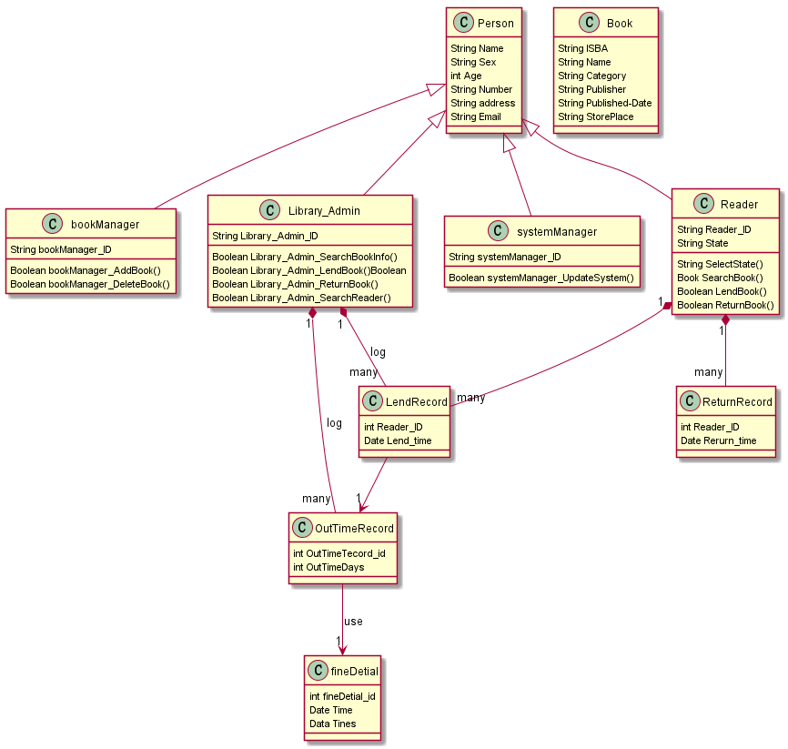

# 实验3：图书管理系统领域对象建模（老师示范）
|学号|班级|姓名|
|:-------:|:-------------: | :----------:|
|201710414401|软件(本)17-4|陈泯全|
## 1. 图书管理系统的类图

### 1.1 类图PlantUML源码如下：

``` class
@startuml
class Person {
  String Name
  String Sex
  int Age
  String Number
  String address
  String Email
}
class bookManager{
  String bookManager_ID
  Boolean bookManager_AddBook()
  Boolean bookManager_DeleteBook()
}
class Library_Admin {
  String Library_Admin_ID
  Boolean Library_Admin_SearchBookInfo()
  Boolean Library_Admin_LendBook()Boolean
  Boolean Library_Admin_ReturnBook()
  Boolean Library_Admin_SearchReader()
}
class systemManager {
  String systemManager_ID
  Boolean systemManager_UpdateSystem()
}
class Reader {
  String Reader_ID
  String State
  String SelectState()
  Book SearchBook()
  Boolean LendBook()
  Boolean ReturnBook()
}
class Book {
  String ISBA
  String Name
  String Category
  String Publisher
  String Published-Date
  String StorePlace
}
class LendRecord{
 int Reader_ID
 Date Lend_time
}
class ReturnRecord{
 int Reader_ID
  Date Rerurn_time
}
class OutTimeRecord{
 int OutTimeTecord_id
 int OutTimeDays
}

class fineDetial{
 int fineDetial_id
 Date Time
 Data Tines
}

Person <|-- Library_Admin
Person <|-- systemManager
Person <|-- Reader
Person <|-- bookManager

Reader"1" *-- "many"LendRecord
Reader"1" *-- "many"ReturnRecord
LendRecord--> "1"OutTimeRecord
Library_Admin"1" *-- "many"LendRecord:log
Library_Admin"1" *-- "many"OutTimeRecord:log
OutTimeRecord--> "1"fineDetial:use
@enduml
```

### 1.2. 类图如下：

参见图8.17



### 1.3. 类图说明：
* 该类图列出了图书馆系统的主要类，及其类之间的依赖关系、聚合关系、组合关系等。
* 从类图中可以很清楚的看出维护系统、登记赔偿、借出图书等类都是依赖于图书管理员这个类来实现的。
* 还有读者类与登录类之间的组合关系，读者通过登录图书管理系统之后才能借书，还书等类的操作。
## 2. 图书管理系统的对象图
### 2.1 类Book的对象图
#### 源码如下：
``` class
@startuml
object Book {
  ISBA=" 978-7-111-60046-6"
  Name="深度学习实战 "
  Category="计算机技术"
  Publisher=" 北京：机械工业出版社"
  Published-Date="2020.06"
  StorePlace="二楼"
}
@enduml
``` 
#### 对象图如下：


### 2.2 类Library_Admin的对象图
#### 源码如下：
``` class
@startuml
object Library_Admin {
  Library_Admin_ID="L001"
  Name="陈泯全"
  Sex="男"
  Age=22
  Number="15958720181"
  address="四川省成都市龙泉驿"
  Email="zz@163.com"
}
@enduml
``` 
#### 对象图如下：


### 2.3 类Reader的对象图
#### 源码如下：
``` class
@startuml
object Reader {
  Reader_ID="000021"
  Name="陈程"
  Sex="男
  Age=20
  Number="13678654955"
  address="四川省成都市龙泉驿"
  Email="78@163.com"
  State="No"
}
@enduml
``` 
#### 对象图如下：


### 2.2 类SystemManager的对象图
#### 源码如下：
``` class
@startuml
object SystemManager {
  systemManager_ID="001"
  Name="陈军"
  Sex="男"
  Age=30
  Number="17699654688"
  address="成都市青白江区"
  Email="chenjun@163.com"
}
@enduml
``` 
#### 对象图如下：
