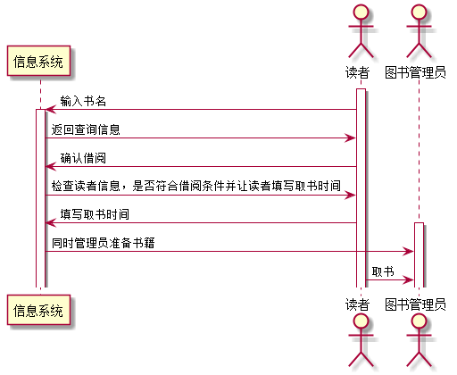
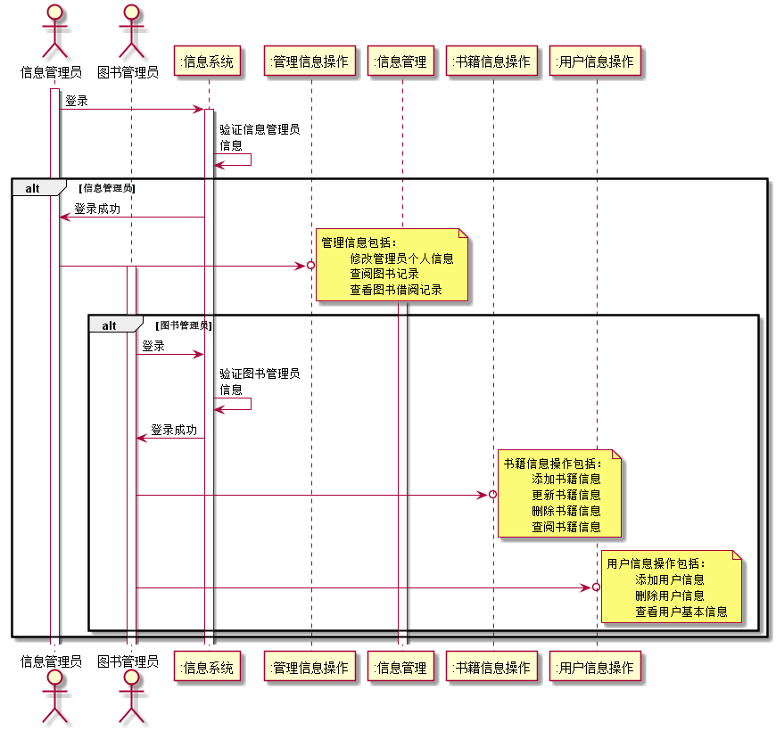
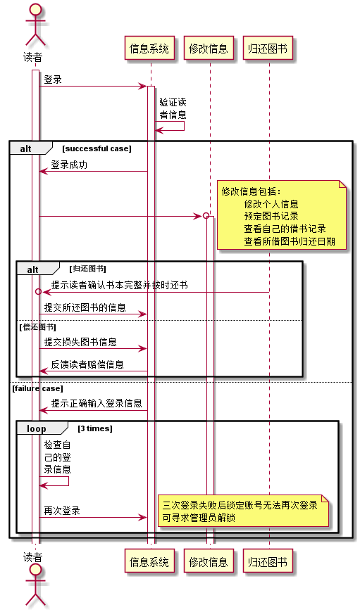

# 实验4：图书管理系统顺序图绘制
|学号|班级|姓名|
|:-------:|:-------------: | :----------:|
|201710414401|软件(本)17-4|陈泯全|

## 图书管理系统的顺序图

## 1. 借书用例
## 1.1. 借书用例PlantUML源码

``` sequence
@startuml
participant 信息系统
actor 读者
actor 图书管理员
activate 读者
读者 -> 信息系统:输入书名
activate 信息系统
信息系统 -> 读者:返回查询信息
读者 -> 信息系统:确认借阅
信息系统 -> 读者:检查读者信息，是否符合借阅条件并让读者填写取书时间
读者 -> 信息系统:填写取书时间
activate 图书管理员
信息系统 -> 图书管理员:同时管理员准备书籍
读者 -> 图书管理员:取书
@enduml
```

## 1.2. 借书用例顺序图


## 1.3. 借书用例顺序图说明
+ 当读者在系统中输入要查询的书籍，系统查询这本数，如果查到，就显示给用户
+ 读者看到查询结果后，选择是否借阅，如果借阅就点击借阅按钮
+ 系统查询读者的信息，并判断是否能借出并给出提示信息，如果能借，就告知读者填写取书时间
+ 读者填写借阅时间后，系统讲这个信息发送给图书管理员，管理员等待读者来取书
***

## 2. 还书用例
## 2.1. 还书用例PlantUML源码

``` sequence
@startuml
actor 图书管理员
participant ":信息系统"
actor 读者
activate 读者
participant ":借阅记录"
读者 -> 图书管理员:归还图书,提交个人信息
loop
deactivate 读者
activate ":借阅记录"
activate 图书管理员
图书管理员 --> ":借阅记录":提交读者信息
":借阅记录" --> 图书管理员 :反馈借阅信息
图书管理员 --> 读者:验证借阅信息:False ,提交无可还书信息
图书管理员 -->":信息系统":验证借阅信息:True ,提交还书信息
activate ":信息系统"
":信息系统" --> ":信息系统":验证还书信息
":信息系统" -> 图书管理员: True
end
图书管理员 -> ":借阅记录":验证成功，更新借阅信息
@enduml
```

## 2.2. 还书用例顺序图


## 2.3. 还书用例顺序图说明
+ 读者将归还的图书交给图书管理员，并提交自己的相关信息。
+ 图书管理员将还书信息提交给系统，系统匹配借书信息并返回验证结果，返回结果为true，图书管理员则判定还书成功。
***
### 3.信息管理员与图书管理员信息管理用例
### 3.1 信息管理员与图书管理员信息管理用例PlantUML源码
```
@startuml
actor 信息管理员
actor 图书管理员
participant ":信息系统"
activate 信息管理员
信息管理员 -> ":信息系统":登录
activate ":信息系统"
":信息系统" -> ":信息系统":验证信息管理员\n信息
alt 信息管理员

	":信息系统" ->信息管理员:登录成功
	信息管理员 ->o ":管理信息操作"
	note right
	管理信息包括：
    	修改管理员个人信息
    	修改图书管理员信息
    	查阅图书记录
    	查看图书管理员记录
    end note
	activate ":信息管理"
alt 图书管理员
activate 图书管理员
图书管理员 -> ":信息系统":登录
":信息系统" -> ":信息系统":验证图书管理员\n信息
":信息系统" ->图书管理员:登录成功
图书管理员 ->o ":书籍信息操作"
note right
	书籍信息操作包括：
    	添加书籍信息
    	更新书籍信息
    	删除书籍信息
    	查阅书籍信息
    end note
图书管理员 ->o ":用户信息操作"
note right
	用户信息操作包括：
    	添加用户信息
    	更新用户信息
    	删除用户信息
    	查看用户基本信息
    	验证用户借阅信息
    end note
end
end
@enduml
```
### 3.2 信息管理员与图书管理员信息管理用例图

### 3.3 信息管理员与图书管理员信息管理用例说明
+ 信息管理员信息管理包括修改管理员个人信息，修改图书管理员信息，查阅图书记录，查看图书借阅记录。
+ 图书管理员信息管理书籍信息操作包括：添加书籍信息，更新书籍信息，删除书籍信息，查阅书籍信息。
+ 图书管理员信息管理用户信息操作包括：添加用户信息，删除用户信息，查看用户基本信息。

### 4.赔偿书籍用例
### 4.1 赔偿书籍用例PlantUML源码
```
@startuml
actor "读者"
participant "信息系统"
activate "读者"
"读者" -> "信息系统":登录
activate "信息系统"
"信息系统" -> "信息系统":验证读\n者信息
alt successful case

	"信息系统" ->"读者":登录成功
	"读者" ->o "修改信息"
	note right
	修改信息包括：
    	修改个人信息
    	预定图书记录
    	查看自己的借书记录
    	查看所借图书归还日期
    end note
	activate "修改信息"
alt 归还图书
"归还图书" ->o "读者":提示读者确认书本完整并按时还书
"读者"->"信息系统":提交所还图书的信息
else 偿还图书
"读者" ->"信息系统":提交损失图书信息
"信息系统"->"读者":反馈读者赔偿信息
end
else failure case

	"信息系统" ->"读者": 提示正确输入登录信息
	loop 3 times
   "读者" -> "读者":检查自\n己的登\n录信息
   "读者" -> "信息系统":再次登录
   note right
   三次登录失败后锁定账号无法再次登录
   可寻求管理员解锁
       end note
   end
end
@enduml
```
### 4.2 赔偿书籍用例图

### 4.3 赔偿书籍用例说明
根据借书用例图:
+ 首先是读者通过登录验证，失败三次，账号将被封锁。
+ 读者成功通过登录验证，能实现基本操作：修改信息包括：修改个人信息，预定图书记录，查看自己的借书记录，查看所借图书归还日期。
+ 其次实现书籍的归还，以及书籍的赔偿。