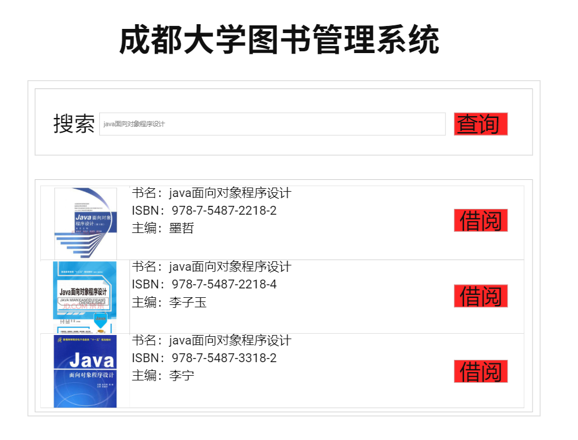

# 实验5：图书管理系统数据库设计与界面设计
|学号|班级|姓名|
|:-------:|:-------------: | :----------:|
|201710414401|软件(本)17-4|陈泯全|
## 1.数据库表设计
## 1.1. 图书表(Book)

|字段|类型|主键，外键|可以为空|默认值|约束|说明|
|:-------:|:-------------:|:------:|:----:|:---:|:----:|:-----|
|ISBN|varchar2(100)|主键|否|||图书标识符|
|Name|varchar2(100)| |否|||图书名称|
|Category|varchar2(100)| |否|||图书类别|
|Publisher|varchar2(100)| |是|||出版社|
|Publisher-Date|date| |是|||出版时间|
|Stock|int| |否|10||图书库存|

## 1.2. 读者表(Reader)

|字段|类型|主键，外键|可以为空|默认值|约束|说明|
|:-------:|:-------------:|:------:|:----:|:---:|:----:|:-----|
|Reader_ID|varchar2(100)|主键|否|||读者ID|
|Name|varchar2(100)| |否|||姓名|
|Sex|varchar2(100)| |否|||性别|
|Age|int| |是|||年龄|
|Number|varchar2(100)| |否|||电话号码（必填信息）|
|address|varchar2(100)| |是|||地址信息|
|Email|varchar2(100)| |是|||电子邮箱|
|State|int| |否|0||借阅状态:<br>0-未借阅<br>1-已借阅|

## 1.3. 图书管理员表(Library_Admin)

|字段|类型|主键，外键|可以为空|默认值|约束|说明|
|:-------:|:-------------:|:------:|:----:|:---:|:----:|:-----|
|Library_Admin_ID|varchar2(100)|主键|否|||图书管理员ID|
|Name|varchar2(100)| |否|||姓名|
|Sex|varchar2(100)| |否|||性别|
|Age|int| |是|||年龄|
|Number|varchar2(100)| |否|||手机号码（必填信息）|
|address|varchar2(100)| |是|||地址|
|Email|varchar2(100)| |是|||电子邮箱|

## 1.4. 信息管理员表(InfoManager)

|字段|类型|主键，外键|可以为空|默认值|约束|说明|
|:-------:|:-------------:|:------:|:----:|:---:|:----:|:-----|
|InfoManager_ID|varchar2(100)|主键|否|||信息管理员ID|
|Name|varchar2(100)| |否|||姓名|
|Sex|varchar2(100)| |否|||性别|
|Age|int| |是|||年龄|
|Number|varchar2(100)| |否|||手机号码（必填信息）|
|address|varchar2(100)| |是|||地址|
|Email|varchar2(100)| |是|||电子邮箱|

## 1.5. 借阅表(Table_Lend)

|字段|类型|主键，外键|可以为空|默认值|约束|说明|
|:-------:|:-------------:|:------:|:----:|:---:|:----:|:-----|
|ISBN|varchar2(100)|主键|否|||图书标识符|
|Reader_ID|varchar2(100)||否|||读者ID|
|Lend_Date|date||是|||借出图书时间|
|Back_Date|date||是|||归还图书时间|
|Overdue_State|int||是|||0-未逾期<br>1-逾期|

## 2. 界面设计
## 借阅书籍界面设计


[界面HTML](https://raw.githubusercontent.com/Frapschen/is_analysis_pages/master/UI/index.html)

- 用例图参见：借阅书籍用例
- 类图参见：用户类、图书类
- 顺序图参见：借阅书籍顺序图
- API接口如下：

1.查询图书信息
- 功能：用于查找图书信息
- 请求地址：<http://Book_System/api/search book>
- 请求方式：post
- 请求参数：

| 参数名  | 必填 | 说明|
|------|-------|------|
| ISBN  | 否 | 用于搜索该书信息|
| Name  | 是 | 用于搜索该书信息|
| Category  | 否 | 用于搜索该书信息|
| Publisher  | 否 | 用于搜索该书信息|
|access_token|是|用于验证请求合法性的认证信息。 |
- 返回实例：
```
{
	"info": "图书详细信息如下",
	"data": [{
			"ISBN": "978-7-5487-2218-2",
			"Name": "java面向对象程序设计",
			"auther": "墨哲",
			"img": "......",
			"number": "10"
		}, {
			"ISBN": "978-7-5487-2218-4",
			"Name": "java面向对象程序设计",
			"auther": "李子玉",
			"img": "......",
			"number": "10"
		},
		{
			"ISBN": "978-7-5487-3318-2",
			"Name": "java面向对象程序设计",
			"auther": "墨哲",
			"img": "......",
			"number": "10"
		}

	],
	"code": 200
}
```
- 返回参数说明：

| 参数名  | 说明 |
|------|-------|
| ISBN  |书籍标识符|
| Name  | 书名|
| auther  | 主编|
| img  | 图片|
| State | 容量状态为“可借”状态|
| number |  库存量|

 2 借阅图书
- 功能：用于查询图书信息
- 请求地址：<http://Book_System/api/lend_book>
- 请求方式：post
- 请求参数：


| 参数名  | 必填 | 说明|
|------|-------|------|
| ISBN  | 是 | 用于确定该图书|
| readerid  | 是 | 读者ID|

- 返回实例：
```
{
	"info": "图书借阅成功",
	"data": {
		"ISBN": "978-7-5487-2218-2",
		"Name": "java面向对象程序设计",
		"Lend_Date": "2019-4-23"
	},
	"code": 200
}
```
- 返回参数说明：

| 参数名  | 说明 |
|------|-------|
| ISBN  |书籍标识符|
| Name  | 书名|
| Lend_Date  | 借阅时间|