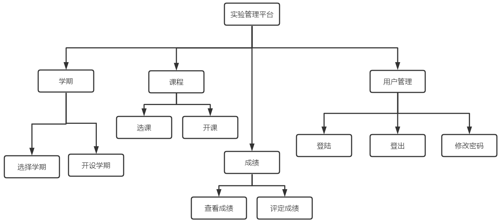
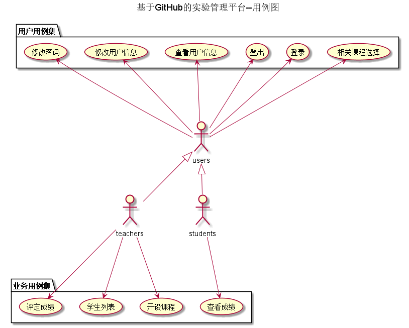
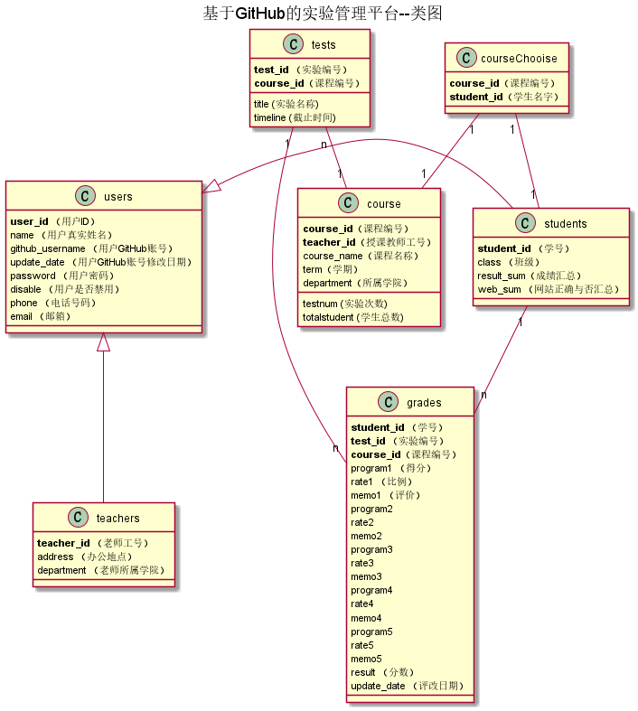

# 基于GitHub的实验管理平台的分析与设计
|学号|班级|姓名|
|:-------:|:-------------: | :----------:|
|201710414401|软件(本)17-4|陈泯全|
## 1.概述

- 老师现在的实验管理平台只是一个最简单的平台，即三单（单学期，单课程，单评分项）， 只考虑了一个学期，一门课程，没有考虑多个学期，多门课程，多评分项实验。现在的实验管理平台中一共有5个实验，每个实验只有一个评分项（0-100分）和对应的文字性的评价。 对于期末课程设计等较大型的实验不能按评分项精确评价学生的实验情况，实验成绩的主观性较强。
- 要做的更改有将（三单改为三多：多学期，多课程，多评分项）：
  * 一个老师可以上多门课，每个老师只能维护老师自己的课程及成绩。
  * 一人同学可以上多门课，每个同学只能查询同学自己的课程的实验成绩。
  * 必须考虑选课了，老师和同学都可以选多门课程，但必须是老师先选，学生后选。
  * 原实验为单评分项实验，要求改为多评分项实验，即每个实验的实验成绩细分为多个评分项，每个评分项对应各自的评分标准。 老师在批改实验的时候，对每个评分项进行评分并输入对应的文字评价，系统自动计算出所有评分项的成绩之和为该实验的总成绩。
  * 考虑到有多个学期，每个学期都有不同的实验。
  * 系统设计在界面上和操作上应该方便老师查询和评阅学生的实验成绩，应该方便学生查询实验成绩。
- 系统功能
  * 基于GitHub的实验管理平台的作用是在线管理实验成绩的Web应用系统。学生和老师的实验内容均存放在GitHUB 页面上。
  * 学生的功能主要有：一是设置自己的GitHub用户名，二是查询自己的实验成绩。学生的GitHub用户名是公开的，但成绩不公开。
  * 老师的功能主要有：一是批改每个学生的成绩，二是查看每个学生的成绩。
  * 老师和学生都能通过本系统的链接方便地跳转到学生的每个GitHUB实验目录，以便批改实验或者查看实验情况。
  * 实验成绩按数字分数计算，每项实验的满分为100分，最低为0分。
  * 系统自动计算每个学生的所有实验的平均分。

## 2.系统总体结构

[界面设计参见](https://frapschen.github.io/is_analysis_pages/UI2/index.html)

## 3.用例图设计 [源码](https://github.com/Frapschen/is_analysis/blob/master/test6/src/class.puml)

## 4.类图设计[源码](https://github.com/Frapschen/is_analysis/blob/master/test6/src/class.puml)

## 5.数据库设计

- ### [数据库设计](https://github.com/Frapschen/is_analysis/blob/master/test6/Database.md)

## 6.用例及界面详细设计

- ### [“评定成绩”用例](usecaseprinciple/.md),[界面](https://frapschen.github.io/is_analysis_pages/UI2/parcticesdetial.html)
- ### [“查看成绩”用例](usecaseprinciple/.md),[界面](https://frapschen.github.io/is_analysis_pages/UI2/parcticesdetial.html)
- ### [“学生列表”用例](usecaseprinciple/.md),[界面](https://frapschen.github.io/is_analysis_pages/UI2/studentlist.html)
- ### [“学生选课”用例](usecaseprinciple/.md),[界面](https://frapschen.github.io/is_analysis_pages/UI2/chooiseclass.html)
- ### [“开课”用例](usecaseprinciple/.md),[界面](https://frapschen.github.io/is_analysis_pages/UI2/startclass.html)
- ### [“修改密码”用例](usecaseprinciple/.md),[界面](https://frapschen.github.io/is_analysis_pages/UI2/changepassward)
- ### [“修改用户信息”用例](usecaseprinciple/.md),[界面](https://frapschen.github.io/is_analysis_pages/UI2/userinfo.html)
- ### [“查看用户信息”用例](usecaseprinciple/.md),[界面](https://frapschen.github.io/is_analysis_pages/UI2/userinfo.html)
- ### [“登出”用例](usecaseprinciple/Login_out.md),[界面](https://frapschen.github.io/is_analysis_pages/UI2/topbar.html)
- ### [“登录”用例](usecaseprinciple/Login_in.md),[界面](https://frapschen.github.io/is_analysis_pages/UI2/login.html)
