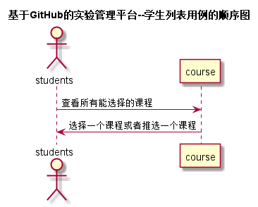

# “学生选课”用例 [返回](../README.md)
## 1. 用例规约

|用例名称|课程列表|
|-------|:-------------|
|功能|学生选择或退选一个课程|
|参与者|学生|
|前置条件|学生需要登录|
|后置条件| |
|主事件流| |
|备选事件流| |

## 2. 业务流程（顺序图） [源码](../src/sequenceStudent_selectCourse.puml)
 

## 3. 界面设计
- 界面参照:https://frapschen.github.io/is_analysis_pages/UI2/chooiseclass.html
- API接口调用
    - 接口1：[selectcourse](../interface/selectcourse.md) 
    - 接口1：[unselectcourse](../interface/unselectcourse.md) 

## 4. 算法描述
无
    
## 5. 参照表

- [SELECT_COURSE](../Database.md/#SELECT_COURSE)